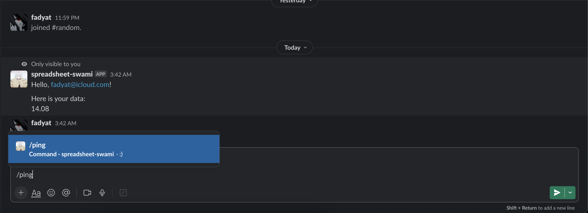

### What is it?

This is a Slack bot that can search and take values from a Google spreadsheet.

### How to use it?

1. Create a new Slack app.
2. Add a bot user to the app.
3. Install the app to your workspace.
4. Register slash commands to the app.
5. Create a new Google service account.
6. Share the Google spreadsheet with the service account.
7. Download the service account credentials file.

Slack applications documentation: https://api.slack.com/apps

Google service accounts documentation: https://cloud.google.com/iam/docs/creating-managing-service-accounts

Google service account keys documentation: https://cloud.google.com/iam/docs/keys-create-delete

More links can be found with an environment variable description.

### Docker image

```shell
docker pull ghcr.io/fadyat/gigaslack:latest
```

### Setup

Required environment variables passed to the container:

```dotenv

# SigningSecret is the signing secret used to verify requests from Slack.
#
# Can be found on the Basic Information page:
# https://api.slack.com/apps/<your-app-id>/general
SLACK_SIGNING_SECRET=""

# BotToken is the bot user OAuth access token.
#
# Can be found on the OAuth & Permissions page:
# https://api.slack.com/apps/<your-app-id>/oauth
SLACK_BOT_TOKEN=""

# Credentials is the string containing the Google service account credentials.
#
# Shortcut for passing credentialsFile content directly from environment variables.
# Can be downloaded from the Google Cloud Console:
# https://console.cloud.google.com/iam-admin/serviceaccounts
#
# JSON needs to be escaped to be passed as an environment variable.
# Example: "{\"type\": \"service_account\", \"project_id\": \"my-project\", ...}"
GOOGLE_CREDENTIALS_STRING=""

# SpreadsheetID is the ID of the Google spreadsheet.
#
# Can access using the URL of the spreadsheet:
# https://docs.google.com/spreadsheets/d/<spreadsheetID>/edit#gid=0
GOOGLE_SPREADSHEET_ID=""

# SpreadsheetRange is the range of the Google spreadsheet.
# 
# For example, "Sheet1!A1:B2" will select the range between A1 and B2 on Sheet1 page
GOOGLE_SPREADSHEET_RANGE="ru 23-24!A1:Z1000"

# SearchingValueFrom is the name of the header that the bot will search passed value.
# 
# For example, if the header is "Name", then the bot will search the value from the "Name" column.
# The header name is case-sensitive.
GOOGLE_SEARCHING_VALUE_FROM="Email"

# TakingValueFrom is the name of the header that the bot will take the value from.
# 
# For example, if the header is "Email", then the bot will take the value from the "Email" column.
# 
# Usecase:
#   In combination with SearchingValueFrom, the bot will search the value from the "Name" column
#   and take the value from the "Email" column.
GOOGLE_TAKING_VALUE_FROM="Name"
```

All additional environment variables can be found in the [config.go](./cmd/config/config.go) file.

### Example:

Here is an example with getting the deadline date for user with email.

```dotenv
GOOGLE_SEARCHING_VALUE_FROM="Email"
GOOGLE_TAKING_VALUE_FROM="Deadline"
```

<div style="display: flex; justify-content: center; align-items: center; flex-direction: row;">
    
    
</div>

